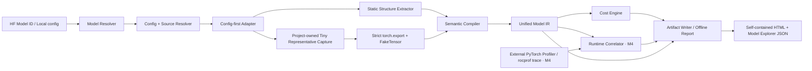

# LLM-Vis：大模型结构与性能可视化完整计划

> 文档状态：Draft v0.1  
> 日期：2026-08-29  
> 项目目录：`/Users/zmu/work/my_project/llamacpp_workspace/llm-vis`  
> 首要入口：Hugging Face / PyTorch 模型代码与配置  
> 首批验证模型：Qwen3.8-27B、GLM-5.3-BF16

## 实施状态（实时维护）

> 最后更新：2026-08-30  
> 当前阶段：**M0–M3.5 已完成；M4a 因 AMD reference stack 未冻结而保持 Blocked**  
> 状态规则：只有对应机器退出清单全部通过后才标记为完成；代码存在但尚未验收时保持“实施中”。

| 里程碑 | 状态 | 当前证据 | 下一退出检查 |
|---|---|---|---|
| M0 | **完成** | IR/schema、三模型 structure golden、9 份 M0 Decision Record、UI wireframe、measurement protocol、离线报告与 bounded-spike 书面结论齐全；全仓现累计 10 份 DR | 历史 M0–M3 静态退出资产 20/20；当前含 M3.5 累计 24/24；官方 Model Explorer consumer 仍按 DR-0003 标为 Partial |
| M1 | **完成** | Tiny/Qwen/GLM config-first adapter、离线 resolver、稳定 ID/canonical key 与未物化虚拟 Tensor/Edge inventory；Qwen 886/1014、GLM 700/778，真实 buffer/缺失 shape 保持 Unknown | 保持结构 golden、schema 与离线安全回归 |
| M2 | **完成** | 三种项目自有 Tiny 语义代表块在 meta/FakeTensor 上严格 export；6 类 op-pattern、decoder attention 逐区域 captured/config-only、异常层标记、LogicalOp/Tensor/Lowering 与 opaque 注入均通过 | GLM DSA/MoE 动态捕获仍按既定边界延后 M5 |
| M3 | **完成** | BF16/FP16/冻结 INT4、可由 artifact Symbol 绑定离线复算的公式、decoder-only aggregate scope、热点、显式 HardwareProfile roofline、workload diff 与六页 Inspector 均通过 | 理论值继续与 Runtime measured 字段隔离；无 trace 时 Runtime 保持 Unknown |
| M3.5 | **完成** | renderer-neutral GraphView/schema、Qwen/GLM L0→L1 config 语义 DAG、`L1 ›` 可发现下钻、端口级连线、state rail、Scenario 理论热力层、可读缩放/minimap、搜索/路径高亮和六页 Inspector 已贯通；UI 已收敛为中央主图 + 按需 Browse/Inspector/Layers/Analysis | 24/24 机器退出项、Python 3.9/3.12 各 150 项、Qwen/GLM 真实浏览器 DAG-01–DAG-13 PASS；继续保持零目标模型执行，热力层明确非实测 latency |

### 已冻结的执行边界

- M0–M3.5 默认 **零权重、零完整模型 `forward()`**，任何结构分析都不得依赖完整模型推理；
- 已知架构由 config adapter 直接生成惰性 Definition/Instance、代表模板和虚拟 Expert Pool；
- 完整 meta module tree 在 M0–M3.5 禁用且没有 CLI opt-in；仅对项目自有 Tiny 语义代表 Block 使用 meta/FakeTensor；
- `torch.export` 只允许捕获 Tiny fixture 或缩小后的代表性 Block，不得因捕获失败退回完整模型执行；失败区域必须成为 opaque node 与 Diagnostic；
- M4 Runtime 的核心工作流固定为导入外部目标环境产生的 trace，LLM-Vis 核心程序不负责启动完整模型；
- 没有 trace 时，Runtime latency、Kernel、HBM counter 等指标保持 `Unknown`，不得从静态结构伪造；
- MVP 禁止执行 Hugging Face remote code；配置与源码可静态读取，Python 模型代码只能在未来经审计的隔离策略下执行。

### 冻结的首批模型 revision

| 模型 | Hugging Face revision | 用途 |
|---|---|---|
| `Qwen/Qwen3.8-27B` | `1d4bf0f2ff6012fd82039f2fa52739d0dd7c60c0` | M1 完整 config adapter；M2 只使用缩小代表块/fixture |
| `zai-org/GLM-5.3-BF16` | `304b8051cfb2b260b61ce0cbe330e02a98e73639` | M1 config-level 宏观结构与 MoE 虚拟化验收 |

### 实施日志

| 时间 | 变更 | 验证 |
|---|---|---|
| 2026-08-29 | 建立 Python 工程、Model Map IR v0.1、Scenario/Metric/Diagnostic、稳定 ID 与三份 JSON Schema | IR/ID 在 Python 3.9 与 3.12 共 15 项测试通过；Draft 2020-12 schema 独立校验通过 |
| 2026-08-29 | 建立 config resolver、整数成本参考公式和隔离式 meta 预算基础设施 | 当前基础测试 32 项中 29 项通过；发现并修复 macOS `RLIMIT_AS` 不可用问题，meta 预算 3 项复测通过；整体验收仍待 adapter 合并 |
| 2026-08-29 | 完成 Tiny/Qwen3.8/GLM-5.3 config-first adapter、虚拟重复层/Expert Pool、离线 artifact writer 和结构 golden | 三模型宏观图均可由 IR 重建；GLM 75 个 MoE 层复用一个 ExpertPool Definition 且不物化 256 个专家；M1 退出清单通过 |
| 2026-08-29 | 完成项目自有 Tiny Dense/Full Attention/Linear State 代表块的 meta/FakeTensor `torch.export` 与 IR 转换 | 捕获及合并定向测试 18 项通过；Qwen 代表层选择、opaque 故障注入和“无完整模型回退”均有自动化断言 |
| 2026-08-29 | 完成 symbolic cost engine、分组对称 INT4（g128/FP16 scale）、基础 roofline 与同模型 workload diff | 成本测试 34 项、当前全量 108 项通过；Tiny BF16 prefill 与 Qwen INT4 decode golden 已冻结；GLM 未知 executed cost 保持 `null` |
| 2026-08-29 | 将 M2/M3 接入统一 artifact：capture/hardware/hotspots/roofline/workload diff JSON、Markdown 与完全离线 HTML；新增 Scenario 切换、搜索、Inspector 与 Runtime Unknown 面板 | 本地浏览器实际打开 Qwen/GLM 报告且无脚本告警；Qwen prefill/decode 切换和节点成本联动通过；GLM 未知成本不排名、不补零 |
| 2026-08-30 | 补齐 M1 config-first Tensor/Edge inventory、M2 pattern/decoder-attention 逐区域 coverage 与逐对象 capture provenance、M3 Symbol/formula provenance 与 decoder aggregate scope，并升级六页联动 Inspector | Python 3.9 与 3.12 均为 139 项测试通过；Ruff 通过；structure golden current；`verify_milestones --milestone all` 为 20/20 PASS |
| 2026-08-30 | 用最终 artifact 做浏览器验收 | Qwen layer.0 整层保留 Dense+Linear 聚合，但具体 FFN/Attention Inspector 精确绑定各自 capture source；layer.1 config-only 不串入 capture；页头分开结构范围与已知成本指标（GLM 78/82、3/8）；GLM dynamic cost/roofline/Runtime 保持 Unknown/null/0% coverage；两页 console 无 warning/error |
| 2026-08-30 | 正式启动 M3.5 Netron/ComfyUI 风格 DAG 主画布 | 先补 renderer-neutral GraphView 与 config 可证明的 activation data/route/control 边，再交付 Qwen/GLM L0→L1 离线可操作画布；不运行目标模型，不把语义投影冒充完整算子执行图 |
| 2026-08-30 | 完成 M3.5 Qwen/GLM L0→L1 端口级 DAG 与真实浏览器验收 | `graph-view.json` schema/golden、内容寻址 ModelMap 引用、单输入单生产者与纯 data 输出可达性均通过；Qwen 3 个 view、GLM 3 个 view；节点/port/edge、三行 Tensor 标签、下钻/Back、Layer Strip、搜索/热点、上下游高亮、pan/zoom/Fit/minimap、Scenario 刷新和 Unknown 原因均实测通过；console 为空，安全标志全为 false |
| 2026-08-30 | 完成 M3.5 graph-first UI 收敛 | 移除默认三栏常驻布局；中央 DAG 独占首屏，模型/revision、Scenario、唯一搜索和状态入口进入紧凑顶栏；Browse/Inspector 改为可关闭抽屉，Layers/Supporting analysis 默认折叠；搜索/图选择不自动用 Inspector 遮挡路径高亮；Qwen/GLM 真实浏览器复测通过 |
| 2026-08-30 | 完成 M3.5 下钻可发现性与理论瓶颈热力层 | 仅有效下钻目标显示 `L1 ›`，角标点击/双击/Enter/Space 契约通过；新增 Pressure/Compute/Memory/Off，按当前 Scenario/view 从完整 Metric 做显式组件归属，legend/Inspector 保留公式、coverage、HardwareProfile synthetic provenance 与非 latency 声明；Qwen Attention/FFN 可归因，GLM 全图 Unknown 不补 0；DAG-12/13 浏览器验收通过 |

## 0. 执行摘要

LLM-Vis 的目标不是把一张几万节点的计算图画得更大，而是构建一个“LLM 时代的模型结构与性能工作台”：用户既能快速理解一个新模型采用了什么架构，也能在指定 workload 下判断计算、访存、KV/state、路由和 GPU Kernel 的瓶颈。

现代开源 LLM 通常不存在一份像 ONNX 那样自包含、静态且唯一的模型图。它的结构由以下内容共同决定：

1. `config.json` 中的模型类型和结构参数；
2. Transformers 或模型仓库中的 PyTorch `nn.Module` 与 `forward()`；
3. 某次输入、cache 状态和运行参数触发的实际逻辑路径；
4. 编译器、推理框架、量化方案和 GPU 后端产生的融合与 Kernel。

因此，LLM-Vis 必须融合多种来源，而不能依赖单一抓图工具：

```text
config + 已知架构 adapter
        ↓
配置可证明的完整宏观层级与虚拟 Tensor inventory
        ↓
项目自有 Tiny 语义代表块的严格 torch.export（可选）
        ↓
LogicalOp / Tensor / Lowering + 公式成本
        ↓
外部 PyTorch Profiler / rocprof trace（M4 导入，不由本工具运行模型）
        ↓
融合算子、HIP Kernel 与实测瓶颈（M4+）
```

首版明确采用以下策略：

- 不依赖 GGUF，也不要求下载大模型权重；
- M0–M3 以 Hugging Face Model ID、本地 `config.json` 或包含它的 Transformers 目录作为入口；本地 Python import adapter 延后 M5；
- 已知架构由 config adapter 直接生成惰性的完整宏观骨架；meta/FakeTensor 只构造项目自有 Tiny 语义代表块，不构造目标模型模块；
- 用“模板定义 + 层实例”压缩重复层；
- 只捕获项目自有 Tiny 语义代表 Block，并通过 Lowering 关联到目标配置中的代表实例；不捕获或执行 27B/700B 目标模型 Block；
- 将 prefill 和 decode 作为不同 workload 分析；
- 所有指标标注为 `精确`、`公式估算`、`实测` 或 `未知`；
- M0–M3.5 交互验收使用自包含离线 HTML；同时输出有节点上限的 Model Explorer-compatible JSON，官方 consumer 仍按 DR-0003 保持 Partial。

## 1. 项目定位

### 1.1 一句话定位

一个面向 LLM 的交互式架构与性能工作台：从模型语义结构逐层钻取到 Tensor、逻辑算子、融合实现和 GPU Kernel，并解释指定 workload 下瓶颈为什么出现。

### 1.2 要解决的核心问题

产品必须帮助用户回答以下问题：

1. 这个模型由哪些语义组件组成？
2. 哪些层完全重复，哪些层是例外或周期性变化？
3. 每个组件的输入输出、shape、dtype 和状态是什么？
4. 在 prefill、decode、不同 batch 和上下文长度下，计算量与数据量分别是多少？
5. 模型是 compute-bound、HBM bandwidth-bound，还是 launch/synchronization-bound？
6. MoE 每个 token 实际激活多少参数，专家负载是否均衡？
7. 语义模块最终被分解或融合成了哪些算子与 HIP Kernel？
8. 静态预测与真实 profiler 结果为什么不同？

### 1.3 非目标

首期不做以下承诺：

- 不展示或编辑具体权重内容；
- 不依靠 safetensors 参数名猜测一份完整 forward graph；
- 不承诺仅凭静态结构精确预测端到端 latency；
- 不把所有层、所有专家和所有 token 平铺在一张图中；
- 不在首期支持任意 Python 数据相关控制流；无法解析的区域保留为 opaque node；
- 不替代 PyTorch Profiler、rocprof 或 ROCm Compute Profiler，而是消费、关联和解释它们的数据；
- 不在 MVP 同时覆盖所有训练框架、推理框架和多机并行模式；
- 不把 LLM 生成的猜测当作结构或性能事实。

## 2. 目标用户与成功任务

| 用户 | 核心任务 | 默认 Lens | 成功标准 |
|---|---|---|---|
| AI 学习者、研究者 | 三分钟理解最新模型架构 | Learn | 能说清层类型、数据流、状态和关键创新 |
| 模型与推理工程师 | 判断 prefill/decode 理论瓶颈 | Performance | 能找到 Top-N 计算/访存热点及其公式 |
| 框架与后端工程师 | 定位 fallback、融合缺失和同步 | Runtime | 能从语义节点追到算子与 Kernel |
| AMD Kernel 工程师 | 找到值得重写或调优的 Kernel | Runtime/Hardware | 能获得真实形状、调用来源和硬件利用率 |
| 模型作者、技术写作者 | 生成可复现结构说明 | Learn/Report | 能导出带 revision 和来源的报告 |

学习模式和性能模式必须共享同一份数据，只改变默认展开层级与信息密度，避免形成两个相互不一致的产品。

## 3. 基础认知：大模型不存在唯一的一张图

LLM-Vis 将模型分成五个相互关联的层级：

| 层级 | 主要对象 | 回答的问题 |
|---|---|---|
| L0 定义层 | config、模型类、层数、head、expert、modalities | 这是一个什么模型？ |
| L1 语义执行层 | Attention、MLA/DSA、MoE、SSM、FFN、KV/state | 一个 token 如何流过模型？ |
| L2 逻辑算子层 | ATen/custom op、输入输出、shape、dtype | 数学上具体计算了什么？ |
| L3 后端实现层 | decomposition、fusion、layout、fallback、copy | Runtime 准备怎样执行？ |
| L4 硬件运行层 | HIP Kernel、timeline、延迟、带宽、counter | GPU 上实际发生了什么？ |

这些不是五张互不相关的图。系统需要维护多对多映射：

```text
Semantic Module
    ↕ 1:N / N:1
Module Invocation
    ↕
Logical Op
    ↕
Exported ATen / Custom Op
    ↕
Fusion Group / Backend Op
    ↕
Kernel Dispatch
```

例如，一个 Attention 语义节点可能对应数十个逻辑算子，若干融合组和多个 HIP Kernel；一个融合 Kernel 也可能同时实现 Norm、projection 和 elementwise 操作。

## 4. 主要使用场景

### 4.1 三分钟理解一个新模型

M0–M3 输入 Hugging Face Model ID 或本地配置目录；本地 PyTorch 类入口延后 M5。系统不下载权重，输出：

- 模型类型、revision、许可证和代码来源；
- 文本、视觉、音频或其他 tower；
- Dense、MoE、GQA/MQA、MLA/DSA、Linear Attention、SSM 等组件；
- 重复层、周期性结构和异常层；
- 总参数、active 参数、KV/state 概览；
- 与经典 Dense Transformer 的关键差异。

### 4.2 检查代表性 Block

用户从模型宏观图进入一种代表性 Block，查看：

- 输入输出 Tensor、shape、dtype、layout；
- residual、route、state read/write 等不同边类型；
- 参数、FLOPs/MACs、逻辑读写字节和算术强度；
- 公式、假设、数据来源与覆盖率；
- 对应源码文件和符号位置；
- 该模板有哪些层实例，实例之间有什么差异。

### 4.3 比较 prefill 与 decode

用户设置：

- batch size；
- prompt/query length；
- current KV length；
- output length；
- dtype、权重量化和 KV cache dtype；
- backend 和硬件；
- MoE routing 的静态假设或实测分布。

界面实时比较：

- 各语义模块 FLOPs；
- 权重、activation、KV/state 的容量和最小逻辑流量；
- 算术强度与理论 roofline；
- 理论热点排名；
- 模型参数变化对瓶颈的影响。

### 4.4 解释真实运行瓶颈

导入 PyTorch Profiler、rocprofv3 或 ROCm Compute Profiler 数据后：

- 将实测 GPU 时间覆盖到语义节点；
- 建立 `Module → ATen → fused op → HIP Kernel` 关系；
- 标记 fallback、未融合、同步、异常 memcpy 和 launch 过多；
- 对比理论热点与实测热点；
- 展示 HBM/L2/LDS、occupancy、waves、MFMA/VALU 等可用指标；
- 未成功映射的时间单独列出，不能静默丢弃。

### 4.5 对比模型、版本与 workload

支持以下 diff：

- 两个不同模型；
- 同一模型的两个 revision；
- 同一模型的 prefill 与 decode；
- 两种 batch/context/量化配置；
- 两个 Transformers、PyTorch、ROCm 或 backend 版本；
- 两份 profiler trace。

对比结果包括结构、shape、成本、热点、fusion 和 Kernel 映射变化。

### 4.6 生成可复现报告

导出 HTML、JSON 和 Markdown，记录：

- 模型 ID、本地路径或代码 commit；
- 模型与代码 revision；
- Transformers、PyTorch、分析器版本；
- workload、dtype、量化和 cache 策略；
- 硬件、ROCm 和 backend；
- 成本模型版本；
- trace 标识；
- 每项指标的来源、假设和覆盖率。

## 5. 产品交互与信息架构

### 5.1 多尺度主视图

| 视图层级 | 展示内容 | 默认可见节点目标 |
|---|---|---:|
| Model | Embedding、Tower、Decoder、MTP、Head | 10–30 |
| Stage/Pattern | 重复模式、Dense/MoE 阶段、Layer Type Strip | 20–100 |
| Block | Norm、Attention、MLP、Router、Expert Pool、Residual | 20–100 |
| Logical Ops | matmul、softmax、RoPE、gather、scatter、scan | 50–300 |
| Runtime | fused op、HIP Kernel、memcpy、同步、timeline | 按筛选展示 |

“放大”应切换语义层级和布局，而不是仅对同一张 SVG 做几何缩放。用户始终可以通过 breadcrumb 返回上层。

### 5.2 主页面布局

```text
┌ Model/Revision ─ Workload ─ Prefill|Decode ─ dtype ─ Compare ─ Export ┐
├──────────────┬──────────────────────────────┬─────────────────────────┤
│ 架构树/搜索   │        多尺度主画布            │ Inspector               │
│ 模块与模板    │  语义结构、Tensor 边、热点覆盖  │ Explain / Tensor / Cost  │
│ Layer Strip  │                              │ Runtime / Provenance     │
├──────────────┴──────────────────────────────┴─────────────────────────┤
│ Hotspots | Tensor | Roofline | Timeline | Kernel | Warnings/Coverage  │
└───────────────────────────────────────────────────────────────────────┘
```

顶部 workload 栏是第一等公民。没有 workload 的总 FLOPs、KV cache、bytes 和 latency 结论不得作为确定值展示。

### 5.3 Lens

- **Learn**：隐藏底层噪声，显示模块作用、简化公式和结构差异；
- **Shape**：突出 Tensor shape、dtype、layout、stride、alias 与 state；
- **Performance**：突出 FLOPs、bytes、active params、KV/state 和 roofline；
- **Runtime**：突出 backend、fusion、fallback、Kernel 和实测时间。

### 5.4 重复层压缩

数据模型必须将 Definition 和 Instance 分开：

```text
DecoderBlockDefinition
├── RMSNorm
├── Attention
├── Residual
├── RMSNorm
├── FFN/MoE
└── Residual

Instances
├── layer.0
├── layer.1
├── ...
└── layer.N-1
```

默认展示：

```text
Embedding → Decoder Block × N → Final Norm → LM Head
```

周期性 Hybrid 模型展示为：

```text
[Linear Attention × 3 → Full Attention] × 16
```

用户可以选择：

- 展开代表层；
- 展开指定实例；
- 只看与模板不同的层；
- 查看各实例 metric 的 min/p50/p95/max；
- 对两个实例做结构或运行时 diff。

重复识别优先使用 module scope 和 config 中的层类型；缺失时才使用“op 类型、端口、符号 shape、局部拓扑、state 副作用”的结构哈希。具有不同 state、routing 或副作用的节点不得错误合并。

### 5.5 MoE 展示

默认不展开几百个专家：

```text
Hidden State → Router → Expert Pool [256 total, top-8 active] → Reduce
                         └ Shared Expert × 1
```

Expert Pool 提供三种模式：

- 结构模式：专家总数、top-k、shared experts、capacity；
- 单次路径：当前 token/mini-batch 命中的专家；
- 聚合热图：一段 trace 中的 tokens/expert、负载倾斜和热点。

必须分开展示：

- total parameters；
- active parameters/token；
- dense upper-bound FLOPs；
- routed expected/measured FLOPs；
- permute/gather/scatter/grouped-GEMM 成本；
- expert-parallel communication bytes；
- 静态路由假设与实测分布。

### 5.6 Hybrid Attention 与状态轨道

用 Layer Type Strip 展示不同层类型：

```text
Layer     0  1  2  3  4  5  6  7 ...
Type      L  L  L  A  L  L  L  A ...
KV Cache           █           █
Rec. State █  █  █     █  █  █
```

其中 `A` 表示 Full Attention，`L` 表示 Linear Attention。MLA、Sliding Window、SSM、Dense FFN 和 MoE 使用不同类型标记，但颜色只编码一个主维度，避免视觉混淆。

### 5.7 Inspector

右侧 Inspector 固定包含：

1. **Explain**：组件用途、数据流和简化公式；
2. **Tensors**：输入输出、符号/实例 shape、dtype、layout、stride；
3. **Cost**：参数、active 参数、FLOPs、逻辑 bytes、KV/state、算术强度；
4. **Runtime**：backend、fusion、Kernel、延迟、带宽、fallback；
5. **Provenance**：数据来自 config、源码、export、公式还是 profiler；
6. **Coverage**：已支持、opaque、未映射和失败原因。

## 6. 总体技术架构



### 6.1 组件职责

#### Model Resolver

- 解析 Hugging Face Model ID、revision、本地 `config.json` 或包含它的目录；本地 Python import path adapter 延后 M5；
- 读取 `config.json` 的 `model_type`、`architectures`、`auto_map`；
- 判断代码是否已集成进 Transformers；
- 固定依赖版本和源代码 revision；
- 生成并记录 remote-code 安全策略；MVP 固定为禁止执行。

#### Config-first Adapter / Tiny Capture Builder

- 对已知架构，优先由 config adapter 直接生成 Definition、Instance 和虚拟 Expert Pool，不先创建数万 Python module/parameter 对象；
- 只对项目自有 Tiny 语义代表 Block 使用 meta device/FakeTensor 构造 `nn.Module`；
- 完整 meta tree 在 M0–M3 禁用且没有用户开关；预算 helper 仅为未来 probe 保留，不是任何模型的必经路径；
- 不加载真实参数存储；
- 当前只收集 config 可证明的层级、虚拟参数/状态 Tensor 与显式 shared-weight alias；不读取真实参数名称或 buffers，缺少证据时保持 Unknown；
- 预算 helper 的默认值为 30 秒与 2 GiB，超时/失败结果可诊断回退；当前 CLI 不声称执行完整 meta 构造。

#### Static Structure Extractor

- 合并 config adapter 生成的惰性 Definition/Instance 与项目自有代表块 capture；
- M0–M3 不遍历真实模型的 `named_modules()`、`named_parameters()`、`named_buffers()`；
- 解析 config 中的 layer pattern；
- 收集 config 声明、adapter 语义和父子关系；真实 module class/源码符号留待有证据的后续 adapter；
- 只记录 config 明示的 embedding/head tying 语义；
- 生成 config-level Definition/Instance 骨架。

#### Representative Block Capture

- 根据 Definition 类型选取最少代表实例；
- 只捕获项目自有 Tiny 语义代表 Block，不运行目标模型 Block；
- 使用冻结的 Tiny input contract（当前 B=1、T=4）生成 meta 输入；Scenario 只驱动 M3 公式，不改变 M2 export 图；
- M0–M3 只使用严格 `torch.export`；eager hooks/TorchLens 延后 M5；
- custom op 或数据相关控制流失败时保留 opaque node；
- 不默认保存完整 activation，避免大型模型内存爆炸。

#### Semantic Compiler

- 将 config 语义图与 Tiny exported graph 合并；eager/TorchLens backend 延后 M5；
- M0–M3 由 adapter 识别架构语义，并在 capture 图中验证 Norm、Full/Linear Attention、recurrent state、FFN 与 residual 等已冻结 pattern；
- 折叠重复层并保留实例映射；
- 生成稳定 ID、Tensor 边、state 边和 lowering 关系；
- 记录识别规则、置信度和用户 override。

#### Cost Engine

- 根据符号 shape 和 Scenario 计算参数、FLOPs、bytes、KV/state；
- 提供算子级公式和语义模块聚合；
- 区分总量、每 token、每序列和峰值；
- 区分逻辑最小流量、存储字节、估算 HBM 流量和实测 counter；
- 提供硬件 roofline 与 bottleneck 分类，但不把理论值伪装成实测 latency。

#### Runtime Correlator

- 读取 PyTorch Profiler/Kineto、rocprofv3、ROCm Compute Profiler；
- 使用稳定 semantic marker 与单次运行内的 correlation/dispatch ID 关联 module、op 和 dispatch；
- 支持一个语义节点对应多个 Kernel、一个 Kernel 融合多个语义节点；
- 汇总 latency、launch、copy、sync 和硬件 counter；
- 输出映射覆盖率和未归属时间。

#### Artifact / Report / Frontend

- 保存统一 IR，并输出 JSON、Markdown、自包含 HTML 与 Model Explorer-compatible JSON；
- 当前没有 HTTP/服务端 API；`serve` 与 `import-trace` 尚未实现；
- 自包含 HTML 已完成 Scenario、结构、Inspector、热点、roofline、workload diff、Coverage 与 Runtime Unknown 的离线验收；
- 官方 Model Explorer consumer 的真实加载仍为 Partial；复杂 timeline 属于 M4+。

## 7. 模型接入策略

### 7.1 标准 Transformers 模型

M0–M3 的检测流程：

1. 仅下载或读取 config，并固定 revision/hash；
2. 通过 `model_type`、`architectures` 和 adapter registry 选择已知 config adapter；
3. 由 config 生成 Definition/Instance、虚拟 Tensor inventory、layer pattern 与 state 类别；
4. 未知架构明确报不支持，不导入 Python、不偷偷退回完整 meta tree；
5. 若请求 M2 capture，只运行项目自有 Tiny 语义 fixture，并将结果关联到配置中选定的代表实例；
6. 将所有来源、安全边界、Coverage 与失败原因写入 artifact。

以下入口 Model class 优先级是 M5 的设计约束，M0–M3 尚不解析或实例化任何目标 Model class：

1. 用户显式指定的 class/task；
2. config `architectures` 指向的精确实现类；
3. 与任务匹配的 task-specific AutoClass，例如 `AutoModelForCausalLM` 或当前 Transformers 版本提供的多模态任务 AutoClass；
4. base `AutoModel` fallback。

不同入口可能包含或遗漏 LM Head、Vision Tower、MTP/auxiliary head，因此未来实现不能把它们当作可互换结果。当前 manifest 只记录 config adapter 选择，不声称已经解析 runtime Model class。

对于近期 Transformers 模型：

- `modular_*.py` 更适合人读和语义分析；
- 生成后的 `modeling_*.py` 是实际运行代码；
- 工具可以用 modular source 辅助语义识别，但必须用运行时 model instance 验证结果。

### 7.2 Hugging Face remote code

若 config 包含 `auto_map` 或需要 `trust_remote_code=True`：

- 默认只下载并静态检查代码，不直接在宿主进程执行；
- 显示代码 revision、文件哈希、许可证和依赖；
- 普通 Python 子进程只用于故障隔离，不是安全边界；
- 执行不可信代码必须先进入可验证的 OS/container/VM sandbox，再导入任何 remote configuration/modeling 模块；
- 禁止默认网络、凭据和任意宿主文件访问；
- 设置 CPU、内存和运行时间上限；
- 将执行结果序列化为 IR 后销毁进程；
- MVP 始终禁用 remote code 执行，仅查看 config/source/weights inventory；只有完成并审计 sandbox 后，未来版本才提供显式 opt-in。

### 7.3 本地 PyTorch 模型（M5 路线图）

计划支持用户提供：

- Python import path，例如 `package.module:ModelClass`；
- 构造函数与 config；
- 示例输入生成器；
- 可选语义 adapter；
- 可选成本公式 adapter。

M0–M3 CLI 不接受 Python import path，也不会导入用户模块；本地入口仅限 `config.json` 或包含它的目录。

### 7.4 仅权重模型（未进入 M0–M3）

Safetensors 只能提供 tensor 名称、shape、dtype 和 metadata，无法可靠给出：

- forward 控制流；
- Tensor 之间的数据依赖；
- cache/state 行为；
- MoE 实际路由；
- custom op；
- backend fusion。

因此未来的仅权重输入最多只能生成“参数 inventory”，界面必须明确标记 `Structure unavailable`，不得假装已经恢复计算图。当前 CLI 不读取 safetensors 或其他权重文件。

### 7.5 推理框架与其他格式

M5 及以后可以增加 vLLM、SGLang、llama.cpp 或编译器 IR adapter，用于对比“参考 PyTorch 语义”和“实际推理实现”。这些是运行时数据源，不是 M1 的前置依赖，项目也不依赖 GGUF。

## 8. 统一中间表示：Model Map IR

### 8.1 设计原则

- 框架中立；
- Definition 与 Instance 分离；
- Shape 是符号表达式，不是只保存字符串；
- 边区分 data、weight、state、control 和 route；
- lowering 支持多对多；
- metric 必须携带 Scenario、来源、公式、假设和覆盖状态；
- 所有对象具有稳定 ID；
- 允许 opaque node 和 unknown metric；
- schema 可版本化、迁移和独立验证。

### 8.2 核心对象

```text
Model
SourceArtifact
Symbol
Scenario
Definition
Instance
TensorSpec
Edge
SemanticNode
LogicalOp
Lowering
Metric
TraceEvent
Diagnostic
```

### 8.3 建议字段

```text
Model
  id, name, family, revision, framework, source_artifact_ids[]

SourceArtifact
  id, kind, uri/path, revision, sha256, license, trusted

Definition
  id, kind, label, class_name, ports[], children[], semantic_pattern

Instance
  id, definition_id, parent_id, module_path, layer_index, overrides

TensorSpec
  id, semantic_name, owner_id, symbolic_shape, concrete_shape, shape_known
  dtype, storage_dtype, layout, stride, device, role, alias_group
  origin, materialized, source_artifact_ids[], evidence[]

Edge
  id, source_id, target_id, tensor_id
  kind = data | weight | state_read | state_write | control | route

LogicalOp
  id, domain, op_type, inputs[], outputs[], attrs, scope_instance_id

SemanticNode
  id, kind, label, definition_id, instance_ids[]
  input_tensor_ids[], output_tensor_ids[], child_ids[]
  confidence, evidence[], opaque

Lowering
  id, source_ids[], target_ids[]
  kind = expand | decompose | fuse | split | copy | fallback

Scenario
  id, phase, batch, new_tokens, past_tokens, total_visible_length, output_length
  activation_dtype, weight_format, kv_dtype, backend, hardware

Metric
  id, subject_id, scenario_id, name, value, unit
  origin = exact | formula | estimated | measured | inferred | unknown
  formula, assumptions[], confidence, coverage, coverage_status

TraceEvent
  id, parent_id, correlation_id, category, start, duration
  device, stream, kernel_name, counters

Diagnostic
  id, severity, code, subject_id, message, evidence[]
```

已实现约束：代表体 FakeTensor 元数据逐项标记 `origin=capture`、
`materialized=false`，并绑定唯一 Tiny capture SourceArtifact；LogicalOp
的 `attrs` 同步携带 capture/source/backend/tensor-mode，且 scope 回指所代表的
decoder layer。任何对象都不得借此声称来自目标大模型执行。
Tiny capture SourceArtifact 的 `sha256` 对规范化捕获内容（contract、TensorSpec、
LogicalOp、SemanticNode）取确定性摘要；它不表示目标模型代码或权重的内容摘要。

### 8.4 Shape 表达式

Shape 使用 AST 或可验证的符号表达式，例如：

```text
[B, S, H]
[B, N_Q, S_Q, D_H]
[B, N_KV, S_KV, D_H]
2 * N_KV_LAYERS * B * S_KV * N_KV * D_H * BYTES_KV
```

符号必须记录定义、单位、合法范围和 Scenario 绑定。改变 batch/context 时无需重新捕获整个结构即可重算成本。

### 8.5 稳定 ID

建议 ID 由以下内容构成或哈希生成：

- `artifact_local_id`：包含模型 revision、framework domain、module path、op ordinal 和 capture variant，在单个 artifact 内唯一；
- `canonical_semantic_key`：不包含 revision，由归一化 semantic path、definition signature、symbolic contract 和 structural signature 构成，用于跨 artifact 匹配；
- `scenario_id`：与结构身份分离，避免同一节点因 workload 不同获得不同结构 ID。

不得使用随机 UUID 作为唯一长期标识，否则无法稳定 diff、关联 trace 或缓存分析结果。跨 revision diff 先使用 canonical key 精确匹配，再使用 structural similarity 处理 rename/move；发生结构变化时必须产生 `added/removed/modified/moved/ambiguous` 结果，不能强行认定为同一节点。

## 9. 静态与动态捕获策略

### 9.1 静态层：配置可证明的完整宏观结构，不包含真实执行路径

M0–M3 使用 config + 已知 adapter 获得：

- 配置可证明的 Definition/Instance 宏观层级；
- 配置公式可证明的虚拟参数/state/cache Tensor shape 与归属，全部 `materialized=false`；
- 层类型和实例数量；
- 显式配置能够证明的 shared-weight alias；
- Vision、MTP 等配置声明的 conditional/附属结构。

看不到：

- 真实 `nn.Module`/parameter/buffer 对象、名称和未在 config 中声明的共享关系；
- `torch.nn.functional` 等函数式算子细节；
- 某次 forward 的真实 Tensor 路径；
- 数据相关分支；
- compiler fusion 和 GPU Kernel。

### 9.2 Eager/TorchLens 层：实际语义路径（M5 路线图）

适用于：

- 记录一个代表输入实际执行的 op DAG；
- 获取模块调用和函数式算子的关系；
- 查看输入输出 shape、dtype、device 和源码位置；
- 理解动态、循环或 recurrent 路径。

限制：

- 只能看到执行过的分支；
- 全量捕获大型模型开销高；
- 不能作为 GPU 异步时间的真实性能来源；
- 对 compiled region、分布式、量化 custom op 和 offload 支持可能不完整；
- 不应默认保存所有 activation。

因此未来即使加入 TorchLens，它也只能是语义采集器和验证器，不是最终 profiler。M0–M3 不包含该 backend。

### 9.3 torch.export / FX 层：规范化逻辑 IR

`torch.export` 用代表性输入生成规范化 ATen 图并记录 shape constraints，适合：

- 做算子级成本 pass；
- 统一 functional/module 表达；
- 获取 Tensor metadata；
- 将结果接入 Model Explorer；
- 作为后端 lowering 之前的逻辑基线。

`ExportedProgram` 本身看不到 Inductor、推理框架或 GPU backend 之后的 fusion/decomposition。L2→L3 必须由独立 Backend IR adapter 提供，例如 Inductor debug IR、推理框架 IR、编译日志或 runtime fusion metadata；没有这些来源时，后端实现层显示为 unknown，不从 ATen 图猜测融合结果。

限制：

- 数据相关控制流可能无法导出；
- custom op 可能保持 opaque；
- cache、MoE routing、分布式或设备特定实现可能失败；
- ExportedProgram 仍不是最终 Kernel 图。

失败策略：

1. 仅尝试项目自有 Tiny 语义代表 Block 的严格 export；
2. 参数与输入位于 meta/FakeTensor，禁止加载权重；
3. export 失败即生成 opaque 结果与 Diagnostic，不退回 eager 或目标模型执行；
4. config adapter 继续提供可信的 Tensor contract 与成本公式；
5. Coverage 对 decoder attention SemanticNode 逐区域展示 captured/config-only/opaque；其他 tower/MTP/state 由 config-only 结构和全模型 `CAPTURE_SCOPE_REPRESENTATIVE_ONLY` 明确界定，不冒充已捕获。

### 9.4 代表性 Block 选择

Qwen3.8-27B 的 M2 当前选择：

- Dense FFN、Linear Attention/State、Full Attention 各选 1 个配置实例；
- 实际 export 的是三种项目自有 Tiny fixture，二者仅按 `semantic-kind-only` 关联；
- Vision 与 MTP 只保留 config 语义，其中 MTP 单独标记为 conditional path；
- 其余未捕获 decoder attention 层逐区域标记为 config-only，而不是暗示已有 LogicalOp；Vision/MTP 等区域保持 config-only 并受全模型 capture scope 告警约束。

GLM-5.3 在 M0–M3 只做 config-level 宏观结构与静态公式；DSA/MoE 动态 Block 捕获延后 M5。未来可考虑：

- Dense DSA Block：1 个；
- Sparse DSA + MoE Block：1 个；
- Expert 模板：1 个；
- 256 个 routed experts 只保留实例和参数映射；
- 运行时路由使用分布或单次路径覆盖。

真实模型性能结论必须来自目标完整模型、目标量化和目标 backend 在外部执行环境产生的 trace；LLM-Vis 核心工作流只导入和关联该 trace，不负责启动完整模型。同构缩小模型或单 Block 只用于结构和公式验证，不能替代真实性能结论。

### 9.5 分析能力等级

系统不使用简单的“成功/失败”状态，而是显示当前模型实际达到的能力等级：

| 等级 | 已获得的能力 |
|---|---|
| C0 | 只读取 config、源码索引或参数 inventory |
| C1 | 已知 config adapter 成功生成完整宏观结构；不表示构造过完整 meta tree |
| C2 | 成功捕获至少一种项目自有 Tiny 语义代表 Block |
| C3 | 成功捕获指定 workload 的完整逻辑路径 |
| C4 | 成功关联 runtime op 与 GPU Kernel |
| C5 | 成功采集并覆盖硬件 counter |

即使只达到 C1，工具也应继续提供层级、参数、重复模式和静态成本；不能因为某个 custom op 无法 export，就丢弃此前已经获得的可靠信息。

## 10. 语义识别与图压缩

### 10.1 首批语义模式

- Embedding、LM Head、weight tying；
- RMSNorm、LayerNorm；
- MHA、GQA、MQA；
- RoPE、M-RoPE、partial/interleaved RoPE；
- Full/causal/sliding-window attention；
- Flash Attention 语义节点；
- MLA、DSA、KV low-rank projection；
- Linear Attention、Gated DeltaNet；
- Mamba/SSM/scan/recurrent state；
- GELU/SiLU/SwiGLU/GeGLU FFN；
- Dense MLP、MoE Router、Expert Pool、Shared Expert；
- top-k routing、permute/gather/scatter/reduce；
- Vision Tower、patch embedding、projector；
- KV cache、paged KV、recurrent state；
- MTP/next-token prediction conditional branch。

### 10.2 识别方式

按照可信度从高到低：

1. 官方/项目 adapter 明确声明；
2. config 字段和 model class；
3. module class 与属性；
4. source symbol；
5. logical op pattern；
6. LLM 辅助解释或候选推荐。

LLM 只能提供候选与说明，不能在没有确定性证据时直接写入“已确认”语义。

### 10.3 置信度与覆盖率

每个识别结果记录：

- rule ID；
- evidence；
- confidence；
- 覆盖的原始 module/op；
- 未覆盖的输入输出；
- 是否经过 adapter 或测试确认。

UI 必须允许用户查看原始 op、撤销识别或编写 override。

## 11. Workload 与成本模型

### 11.1 Scenario 参数

```text
B       batch size
T       本次调用处理的新 token 数，也可记为 S_Q
L       调用开始前已有的 KV/context 长度
S_KV    调用结束后的总可见长度，等于 L + T
T_OUT   计划生成 token 数
H       hidden size
I       FFN intermediate size
N_L     layer count
N_Q     query head count
N_KV    KV head count
D_H     head dimension
D_K     key head dimension；普通 Attention 中通常等于 D_H
D_V     value head dimension；普通 Attention 中通常等于 D_H
W       sliding-window size
E       routed expert count
K       top-k experts/token
I_E     single expert intermediate size
B_W     weight storage bytes/element or packed bits
B_A     activation bytes/element
B_KV    KV cache bytes/element
```

Phase 至少分为：

- `prefill`：本次处理 `T > 1` 个新 token，且 `L = 0`；
- `chunked_prefill`：本次处理 `T > 1` 个新 token，且已有 `L > 0` 个 cached token；
- `decode`：通常 `T = 1`，且 `L` 为当前已有上下文长度；
- `train`：非 MVP，可预留 backward、optimizer state 与 activation checkpointing。

为避免把“本次 query 长度”和“已有上下文”混在一起，成本引擎内部统一使用：

```text
T     本次调用处理的新 token 数，也可记为 S_Q
L     调用开始前已经存在的 KV/context 长度
S_KV  调用结束后的总可见长度，S_KV = L + T
```

### 11.2 每个节点应提供的指标

- total parameters；
- active parameters；
- 参数存储 bytes；
- MACs 与 FLOPs；
- logical input/output bytes；
- 算法最小数据流量；
- activation size 与 peak live activation；
- KV cache 总量与 bytes/token；
- recurrent state 总量与 bytes/token；
- arithmetic intensity；
- 理论 compute time、bandwidth time 与 roofline bound；
- op/kernel launch count；
- measured latency 与 counter；
- metric coverage。

### 11.3 基础公式

#### Dense Linear

对于 `[M, K] × [K, N] → [M, N]`：

```text
MACs  = M * K * N
FLOPs = 2 * M * K * N
Logical minimum bytes
      = M*K*bytes(A) + K*N*bytes(W) + M*N*bytes(Y)
```

逻辑最小 bytes 不等于真实 HBM traffic；cache、tiling、fusion、重用和写回策略会改变实际流量。

#### Attention Core

对于 causal attention，本次调用实际参与的 query-key pair 数为：

```text
Pairs = T * L + T * (T + 1) / 2

QK^T FLOPs = 2 * B * N_Q * D_H * Pairs
PV   FLOPs = 2 * B * N_Q * D_H * Pairs
Core FLOPs = 4 * B * N_Q * D_H * Pairs
```

Q/K/V/O projection 单独按 Linear 公式计算。GQA/MQA 的 K/V projection 和 KV cache 使用 `N_KV`，不能误用 `N_Q`。

对于 decode，`T = 1`，因此 `Pairs = L + 1`。Sliding-window attention 的一般形式为：

```text
Pairs = sum(i = 0 .. T-1, min(L + i + 1, W))
```

不能仅把 `L` 替换为 `min(L, W)`，否则在 `T > W` 的长 chunk 中仍会高估当前 chunk 内的 pair。MLA/DSA、Linear Attention 和 SSM 不得套用普通 Attention 公式。

上述公式假设 batch 内序列等长且无 padding。对于 ragged/paged batch，应对每条序列使用各自的 `T_b`、`L_b`、window 和有效 mask 求和。这里计算的是有效算法 FLOPs；融合 Kernel 可能因 tile、padding 或 capacity 执行更多工作，后者作为 `executed FLOPs` 单列。

#### SwiGLU FFN

对于 gate、up、down 三个 projection，忽略 elementwise：

```text
FLOPs ≈ 6 * B * T * H * I
```

若模型使用不同 projection 数、bias、shared expert 或 low-rank 结构，由架构 adapter 覆盖公式。

#### KV Cache

对于维护 K/V cache 的层：

```text
KV bytes / sequence token
  = 2 * N_KV_LAYERS * N_KV * D_H * bytes(KV)

KV bytes / decode step across batch
  = B * KV bytes / sequence token

KV total bytes
  = B * KV bytes / sequence token * (L + T)

KV write logical bytes
  = B * T * N_KV * (D_K * bytes(K) + D_V * bytes(V))
    ，再对维护 KV 的各层求和

Decode ideal KV read logical bytes
  = B * (L + 1) * N_KV * (D_K * bytes(K) + D_V * bytes(V))
    ，再对维护 KV 的各层求和
```

Hybrid 模型不能把所有层都计入 `N_KV_LAYERS`。异构层以逐层求和为准，统一的 `N_KV_LAYERS * N_KV * D_H` 只是同构简写。Linear Attention/SSM 的 recurrent state 必须使用独立公式和状态轨道。UI 必须明确“每条序列的 token”与“整个 batch 的一次 decode step”两个口径。

还要区分：

- occupied KV bytes：有效 token 实际占用；
- allocated/paged KV bytes：包含 page padding、allocator 粒度、量化 metadata 和碎片；
- logical ideal read/write：算法至少需要访问的字节；
- measured HBM traffic：由 counter 获取，可能受 cache、tiling、融合和重复读取影响。

#### MoE

```text
Tokens = B * T

Router FLOPs
  ≈ 2 * B * T * H * E

Useful expert SwiGLU FLOPs
  ≈ 6 * B * T * K * H * I_E
```

还需单独计算 shared expert、route normalization、permute、gather/scatter、grouped-GEMM 和通信。静态 top-k 只是期望模型；真实成本应优先使用 tokens/expert 分布。

在没有真实路由分布时，可以把“本批次触达的不同专家数量”作为估算项。在均匀、独立路由的简化假设下：

```text
Expected touched experts
  ≈ E * [1 - (1 - K/E)^Tokens]
```

该值只能用于估算专家权重流量，必须标记假设；一旦有 runtime route histogram，就用实测 touched experts 和 tokens/expert 替代。

```text
Touched expert weight bytes
  ≈ Expected/Measured touched experts * storage bytes(single expert)
```

成本引擎必须把 `useful` 与 `executed` 分开：grouped-GEMM 的 block padding、capacity、空槽和负载不均会使 executed token slots/FLOPs 高于有效路由量。UI 同时显示 useful/executed token slots、padding ratio、shared expert 成本和 expert weight bytes。

### 11.4 量化

量化不能只把 `参数量 × 4 bit` 当作完整物理成本。至少记录：

- packed weight bytes；
- scale、zero-point、group metadata；
- group size 和 block layout；
- activation/KV dtype；
- dequant 是否融合；
- 临时 buffer；
- fallback 到 BF16/FP16 的算子；
- Kernel 实际读取格式。

UI 区分：

- logical tensor dtype；
- storage format；
- compute dtype；
- accumulator dtype。

### 11.5 指标真实性分级

```text
Exact       来自 config、参数 shape 或 IR 的确定值
Formula     基于明确公式和 Scenario 的理论值
Estimated   依赖 backend/cache/route 等假设
Measured    来自 profiler 或 hardware counter
Inferred    通过相关性或规则推断
Unknown     没有足够信息
```

`Unknown` 不能显示为 0。所有聚合指标必须同时显示覆盖率，避免部分支持被误认为完整结果。

## 12. AMD GPU 与运行时分析路线

### 12.1 数据来源

- PyTorch Profiler/Kineto：module/CPU dispatcher/HIP kernel/timeline；
- `record_function` 或等价 marker：稳定语义 ID；
- rocprofv3：dispatch、timeline、copy、counter；
- ROCm Compute Profiler：Kernel 深度指标和 roofline；
- 可选 Perfetto：跨线程/stream 的统一时间线。

能力边界必须写入 importer 和 UI：

- PyTorch 的 ROCm 环境可能仍沿用 `ProfilerActivity.CUDA` 等兼容命名，产品统一显示为 `GPU/ROCm`，同时保留原始字段；
- PyTorch Profiler 的 `with_flops` 只覆盖部分算子，不能替代项目自己的 Attention/MoE 成本模型；
- ROCm Compute Profiler 的 PyTorch trace/op 映射能力视版本而定，只作为辅助证据，启动时必须做 capability discovery；
- hardware counter 可能需要多次 replay 并串行化 dispatch，counter run 的 wall time 永远不能作为生产 latency；
- timing、timeline trace 和 counter collection 使用独立运行，并在 artifact 中关联。

### 12.2 精确关联原则

不得仅依赖 Kernel 名称进行模糊匹配。稳定的是 semantic ID 和 marker 文本；runtime correlation ID、dispatch ID 通常只在单次运行内有效：

```text
stable semantic_id
  → per-run marker/range event
  → per-run runtime correlation_id
  → per-run dispatch_id
```

映射关系允许：

- 一个语义模块对应多个 Kernel；
- 多个语义模块融合为一个 Kernel；
- 一个 logical op 被拆成多个 dispatch；
- copy、sync 和 allocator event 归属到调用上下文；
- 无法归属的 event 进入 `Unattributed` bucket。

融合 Kernel 的 exclusive time 默认归属 fusion group；参与融合的语义/ATen 节点只建立 shared 或 inclusive attribution，不能把同一 Kernel 时间重复累计到多个父节点。

### 12.3 AMD 重点指标

- GPU time、dispatch count、launch gap；
- HBM read/write、effective bandwidth；
- L2 hit/miss、cache reuse；
- LDS 使用和 bank conflict；
- VGPR/SGPR 使用；
- occupancy、active waves；
- MFMA utilization；
- VALU utilization；
- memory/compute stall；
- host-device copy 与同步；
- shape、dtype、layout 与 Kernel variant。

### 12.4 静态与实测对比

每个语义节点同时展示：

```text
理论 FLOPs
逻辑最小 bytes
理论 roofline bound
估算瓶颈类型
实测 latency
实测或估算 HBM traffic
实际 Kernel 数量
差异解释
```

差异解释只在有证据时给出，例如：fallback、未融合、多余 copy、负载不均、低 occupancy 或 launch fragmentation。

### 12.5 AMD 能力分级

不同 AMD GPU 和 ROCm 工具支持范围不同，运行时能力按 Tier 降级：

| Tier | 能力 | 典型环境 |
|---|---|---|
| A | 结构、静态成本、`torch.export`、PyTorch Profiler | 可运行 PyTorch 的 CPU/GPU |
| B | HIP dispatch、copy、ROCTx、op-to-kernel 关联 | 支持 rocprofv3 的 ROCm 环境 |
| C | HBM/L2/LDS、SOL、occupancy、MFMA、per-kernel roofline | 受 ROCm Compute Profiler 支持的平台，重点为 Instinct |

启动时探测 GPU、gfx、ROCm、counter 和工具版本；缺失能力时明确降级，不把 Instinct 上的深度 counter 能力默认承诺给所有 Radeon。

## 13. 前端与渲染决策

### 13.1 M0/M1：Model Explorer Adapter

> 当前实现：已生成有节点上限、确定性 snapshot 的 Model Explorer-compatible JSON adapter；官方 consumer 的真实加载仍按 DR-0003 保持 Partial。M0–M3 实际交互验收使用项目自包含离线 HTML，核心 IR 与报告不依赖 Model Explorer 包或远程服务。

选择原因：

- 支持分层展开/折叠；
- 支持 PyTorch ExportedProgram；
- 支持搜索、相同层识别和大图渲染；
- 支持自定义 node metadata；
- 可以通过 adapter 接受项目自己的 Model Map IR。

使用边界：

- Model Explorer 只承担图渲染和基础交互；
- 语义层级、重复压缩、成本与 provenance 在 LLM-Vis 后端生成；
- workload、diff、roofline、timeline 和 report 可能需要外围 UI；
- 不将项目数据模型绑定到 Model Explorer 内部 schema。

### 13.2 是否自研前端的决策门槛

满足任意两项时启动自研主画布评估：

- 无法实现 workload 实时切换而不重载图；
- 无法稳定联动 Layer Strip、主图、热点表和 timeline；
- 无法表现多对多 lowering；
- 大于 10k 原始 op 时交互达不到目标；
- diff、expert heatmap 或 state track 需要大量绕过；
- custom adapter 的维护成本高于自研渲染层。

自研时优先 WebGL/canvas，避免把超大图完全交给 DOM/SVG。

## 14. CLI、API 与输出物

### 14.1 M0–M3.5 已实现 CLI 与 M4 预留接口

```bash
# 仅配置，生成结构与静态成本；本地 fixture 可完全离线复现
llm-vis inspect \
  --model tests/fixtures/configs/qwen3_8_27b.json \
  --revision 1d4bf0f2ff6012fd82039f2fa52739d0dd7c60c0 \
  --scenario examples/scenarios/m3-prefill-decode.json \
  --hardware-profile examples/hardware/synthetic-bf16.json \
  --local-files-only \
  --output artifacts/qwen38-27b

# 捕获项目自有 Tiny/meta 语义代表 Block，不构造或运行 Qwen 模型
llm-vis capture \
  --model tests/fixtures/configs/qwen3_8_27b.json \
  --revision 1d4bf0f2ff6012fd82039f2fa52739d0dd7c60c0 \
  --scenario examples/scenarios/m3-prefill-decode.json \
  --local-files-only \
  --kind dense \
  --kind full_attention \
  --kind linear_state \
  --output artifacts/qwen38-27b-capture

# 比较同一 artifact 内的两个 workload（跨 artifact/revision 延后 M5）
llm-vis diff artifacts/qwen38-27b \
  --left-scenario <prefill-scenario-id> \
  --right-scenario <decode-scenario-id> \
  --output artifacts/qwen38-27b/workload-diff.json
```

当前 M0–M3.5 已实现 `inspect`、`capture`、`diff`、`schema` 与 `validate`。`inspect`/`capture` 自动生成 JSON、GraphView、Markdown 与自包含 HTML；`capture` 的 `--kind` 只选择项目自有 Tiny/meta 语义代表块，不存在任意完整模型 capture 开关。`serve` 和 `import-trace` 尚未实现，分别属于可选本地查看便利功能与 M4 范围，不能由上述命令推断为已交付。M4 计划中的 trace 入口仍是 `llm-vis import-trace --model-map ... --trace ... --format ...`，目前不是有效命令。

### 14.2 输出目录

```text
artifacts/<analysis-id>/
├── manifest.json
├── model-map.json
├── graph-view.json
├── scenarios.json
├── metrics.json
├── diagnostics.json
├── layer-strip.json
├── captures.json
├── hardware-profile.json
├── hotspots.json
├── roofline.json
├── workload-diffs.json
├── model-explorer.json
├── reports/
│   ├── report.html
│   └── report.md
```

`graph-view.json` 是 M3.5 已完成的新增产物。它通过由完整 canonical Model Map 内容确定性计算的 `source_model_map_id=mmap_*` 引用同目录 `model-map.json`；节点证据同时保留 `model:art_*` 与 `model_map:mmap_*`，避免把 Model subject ID 冒充 artifact ID。报告内嵌数据与独立 JSON 使用同一投影，而 `model-explorer.json` 继续是次级兼容输出。

### 14.3 API（M0–M3.5 实际边界与后续候选）

M0–M3.5 已提供本地 Python API 与静态 artifact，不启动服务，也没有只读 HTTP API。若 M4/M5 证明多进程浏览或外部集成确有需要，再评估以下本地只读接口：

- `POST /analyses`；
- `GET /analyses/{id}`；
- `GET /analyses/{id}/graph?level=...`；
- `GET /analyses/{id}/nodes/{node_id}`；
- `GET /analyses/{id}/metrics?scenario=...`；
- `POST /analyses/{id}/traces`；
- `GET /diff?left=...&right=...`。

## 15. 建议仓库结构

```text
llm-vis/
├── pyproject.toml
├── README.md
├── doc/
│   ├── llm-visualization-plan.md
│   ├── model-map-ir.md
│   ├── cost-model.md
│   ├── adapter-guide.md
│   ├── runtime-correlation.md
│   └── decisions/
│       └── DR-xxxx-*.md
├── schemas/
│   ├── model-map.schema.json
│   ├── scenario.schema.json
│   └── trace.schema.json
├── src/llm_vis/
│   ├── adapters/
│   │   ├── huggingface/
│   │   ├── local_torch/
│   │   └── runtime/
│   ├── resolver/
│   ├── meta/
│   ├── capture/
│   │   ├── hooks/
│   │   ├── torchlens/
│   │   └── export/
│   ├── semantic/
│   │   ├── patterns/
│   │   └── folding/
│   ├── cost/
│   ├── runtime/
│   ├── ir/
│   ├── report/
│   ├── api/
│   └── cli/
├── web/
│   ├── model-explorer-adapter/
│   └── app/
├── examples/
│   ├── qwen38_27b/
│   └── glm53/
└── tests/
    ├── fixtures/
    ├── unit/
    ├── integration/
    └── golden/
```

## 16. 分阶段交付路线

以下工期以 2 名全职工程师为参考；单人执行可按依赖关系推进，不应机械承诺日历日期。为避免“大而全”导致每条链路都不完整，MVP 采用一条端到端纵切，后续再扩架构和 runtime 深度。

### M0：规格、决策与可行性基线（约 2 周）

> 实施状态：**完成（2026-08-29）**。schema、三模型 golden、9 份 M0 Decision Record、[UI wireframe](ui-wireframe.md)、[measurement protocol](measurement-protocol.md)与 bounded-spike 审计均已归档；全仓在 M3.5 增加 DR-0010 后累计 10 份。DR-0003 对官方 Model Explorer consumer 的审计结论仍为 Partial；M0 接受的是可复现 adapter/离线报告基线和书面 spike 结论，不宣称官方 UI 已全部验收。AMD stack Gate 已明确转化为 M4 阻塞项，未编造开发机性能结论。

交付：

- Model Map IR v0.1、Scenario、Metric、Diagnostic；
- Tiny Dense、Qwen3.8、GLM-5.3 的手工 golden L0/L1 architecture；
- config-first、代表性 meta Block、`torch.export` 和 Model Explorer adapter spike；
- TorchLens 仅做可选 backend 的可行性评估，不进入 MVP 关键路径；
- remote code 威胁模型，MVP 默认禁止执行 remote code；
- 对首个 AMD reference stack 作出 Gate 决策：未冻结 GPU/gfx、ROCm、PyTorch、backend 与 workload 时，M4a 保持 Blocked，不编造默认硬件；
- 冻结本节与“开放问题”中的架构阻塞决策；
- 首版 UI wireframe 和 measurement protocol。

退出条件：同一份 IR 能生成可核验结构视图、六页 Inspector 和成本表；关键 spike 有书面结论；reference stack 和 M1–M3 范围已经写入 Decision Record。官方 Model Explorer 主画布 consumer 仍按 DR-0003 保持 Partial，不计作已完成交互。

### M1：Config-first 静态纵切（3–4 周）

> 实施状态：**完成（2026-08-29）**。Tiny Dense、Qwen3.8-27B 与 GLM-5.3-BF16 均从固定 config/revision 生成确定性 IR/artifact；GLM Expert Pool 保持虚拟化；默认完整 meta tree 关闭，预算 worker 失败/超时可诊断回退。

必做交付：

- Hugging Face Model ID、本地目录和 revision resolver；
- Tiny Dense 通用 adapter；
- 一个明确的 Qwen3.8 config adapter；
- config-first Definition/Instance、虚拟重复层与 Expert Pool；
- 项目自有代表性 meta/FakeTensor Block；完整 meta tree 禁用，预算 helper 仅验证失败回退语义；
- config 可证明的参数/state 类别与 shared-weight 语义；真实 buffer/权重 inventory 不读取权重，缺少证据时保持 Unknown；
- L0/L1 与 config 语义契约、Layer Type Strip、JSON/Markdown/HTML 导出；真实 L2 LogicalOp 只来自 M2 受限代表块；
- GLM-5.3 只要求通过 config adapter 生成可信宏观图，不要求动态捕获全部 MoE 路径。

退出条件：本地缓存命中、不下载权重时，Tiny Dense、Qwen3.8 和 GLM-5.3 能生成通过 golden 的宏观结构；隔离预算 helper 的超时/失败语义有单元测试，而当前 config-first CLI 不进入完整 meta 构造路径。

### M2：单一捕获后端与代表性 Block（4–6 周）

> 实施状态：**完成（2026-08-29）**。唯一捕获后端为 `torch.export`；只捕获项目自有 Tiny Dense、Full Attention、Linear State 语义代表块，并将 Qwen 选中的目标层与这些捕获通过 Lowering 关联。捕获产物固定声明 `architecture_equivalence=semantic-kind-only`、`valid_for_full_model_performance=false`；不加载真实权重、不构造或执行 Qwen/GLM 完整模型。

必做交付：

- 自动选择 Qwen Full Attention 和 Linear Attention 代表实例；
- 以 `torch.export` 为唯一 MVP 主捕获后端；
- unsupported/custom op 的 opaque fallback；
- Dense/Attention/Norm/FFN/Linear Attention 首批语义 pattern；
- 重复图压缩与 Layer Strip 异常层显式标记；跨 artifact/revision 结构 diff 延后 M5；
- Tensor/Source/Coverage Inspector；
- Model Explorer custom adapter。

延后或作为 stretch：TorchLens 完整 backend、GLM MoE 动态 Block 捕获、任意模型全图 export。

退出条件：用户能从 Qwen 宏观图进入代表性 Dense、Full/Linear Attention，查看 Tensor 与 LogicalOp；每个未选中的 decoder attention region 均有 `CAPTURE_REGION_NOT_SELECTED`，其余模型结构由 `CAPTURE_SCOPE_REPRESENTATIVE_ONLY` 明确保持 config-only。

### M3：基础成本与场景 MVP（4–6 周）

> 实施状态：**完成（2026-08-29）**。prefill/chunked prefill/decode、BF16/FP16、冻结 INT4 g128 格式、公式与 property tests、两份 Scenario golden、理论热点、显式 HardwareProfile roofline lower bounds、同 artifact workload diff 和离线报告已贯通。GLM 只输出 config 可证明的 decoder resident/active 参数与存储；DSA/executed MoE 成本保持 Unknown。

必做交付：

- symbolic shape evaluator；
- Dense/GQA/Full Attention/FFN/KV 与 Qwen Linear Attention state 的成本 adapter；
- prefill、chunked prefill、decode；
- BF16/FP16 与一种明确选择的量化存储格式；
- 参数、FLOPs、logical bytes、KV/state、arithmetic intensity；
- 基础 roofline、热点表、Formula/Provenance/Coverage；
- 同一模型的 workload diff。

延后：复杂 GLM/DSA 动态成本、通用 MoE executed-cost 校准、多种量化布局、跨模型 diff。

退出条件：Tiny Dense 和 Qwen 在固定 workload 上生成可追溯的理论热点；GLM 至少能展示 config 级 resident/active 参数和明确的未知成本范围。

### M3.5：端到端语义 DAG 主画布

> 实施状态：**完成（2026-08-30）**。Qwen/GLM `graph-view.json`、schema、golden、离线 SVG 画布和 DAG-01–DAG-13 浏览器退出项已通过；Python 3.9 与 3.12 全量测试各 150 项通过，机器里程碑累计 24/24 PASS。整个实现没有读取权重、构造目标模型或执行目标模型 forward；理论热力层不是一次目标模型运行或 latency 测量。

> 边界：M3.5 不新增目标模型执行。L0/L1 是 adapter/config 证据支持的
> `CONFIG SEMANTIC PROJECTION`；L2 只有项目自有 Tiny 代表块的真实 LogicalOp
> DAG。目标模型未捕获的内部算子保持 config-only/opaque，不为视觉完整而伪造。

契约分工：`model-map.json` 继续是 Definition/Instance/TensorSpec/
SemanticNode/LogicalOp/Metric/provenance 的权威事实层；
`graph-view.json` 只保存 L0/L1 view、节点、端口、可见边、group 与
下钻导航。详细 wire 边界见 [Model Map IR §3.1](model-map-ir.md#31-m35-graphview-产物边界)，
画布与 Inspector 交互契约见 [UI wireframe §4.1](ui-wireframe.md#41-m35-主画布交互契约)。

必做交付：

- 新增 renderer-neutral `graph-view.json` 与 schema：稳定 `GraphNode`、
  `GraphPort`、`GraphEdge`、`GraphGroup`，端口绑定 TensorSpec，边明确
  `source_port_id`、`target_port_id`、tensor、kind、origin、coverage 与 evidence；
- Qwen/GLM adapter 投影 config 可证明的 hidden activation `data`、MoE `route`
  和真实存在的 `control` 语义边；不得为视觉效果伪造 MTP control，MTP 使用
  `decoder hidden → MTP → Draft Logits` 的独立可达数据支路；weight 边默认隐藏，KV/recurrent state 作为独立
  state rail 的 read/write 边界，不用跨 token 回边破坏单步 DAG；
- L0 从输入到输出：Input/Embedding/Vision/Projector/折叠 Decoder Pattern/
  Final Norm/LM Head/Logits，以及 `hidden → MTP → Draft Logits` conditional branch；
- L1 展示代表性 Block：Norm、Attention/DSA、Residual、FFN 或 Router/
  Expert Pool/Shared Expert/Reduce，并显示具体输入输出端口；
- 自包含离线 DAG 画布：左到右分层布局、节点核心信息、port-to-port 连线、
  edge label、pan/zoom/fit/minimap、折叠/展开、breadcrumb、上下游高亮；
- 仅对真实存在的下钻 target 显示 `L1 ›`；角标单击、节点双击和 Enter 下钻，
  Space 只选择，叶节点不显示假入口；
- 主图提供 Pressure/Compute/Memory/Off 理论热力层，按当前 Scenario/view 从完整
  Metric 做显式节点归属与 `raw/max(raw_known)` 归一化；legend/Inspector 显示公式、
  HardwareProfile provenance、origin、coverage、Unknown 原因与非 latency 声明；
- graph-first 页面框架：中央 DAG 默认占满首屏；模型/revision、Scenario、唯一
  全局搜索与 Report status 位于紧凑顶栏；Definitions/Diagnostics 与六页 Inspector
  进入按需抽屉；64/78 层和 Supporting analysis 默认折叠，展开后不挤压主图；
- Layer Strip、搜索、热点和画布双向定位；节点、端口和边联动现有六页
  Inspector；图选择/搜索只更新 Inspector 待查看状态，不自动遮住路径高亮；
  Scenario 切换只更新指标，不改变稳定结构 ID；
- 默认每层级不超过 200 个可见节点；64/78 层和 256 专家按 pattern/group
  折叠，禁止默认全量平铺。

退出条件：

1. 同一 artifact 两次生成的 GraphView byte-equivalent，所有 node/port/tensor/
   group 引用有效，主 data/route/control 子图可拓扑排序；
2. Qwen L0 存在 Input→Embedding→Decoder Pattern→Final Norm→LM Head→Logits
   可达路径，Vision/MTP 分支有 config provenance；
3. Qwen Linear/Full Attention L1 正确区分 recurrent state/KV，GLM sparse L1
   显示 Router→Expert Pool(top-8/256)+Shared Expert→Reduce，未知 DSA 内部保持 opaque；
4. 每条可见线连接具体 output/input port并显示 Tensor 名、shape、dtype；Unknown
   不补零；节点卡显示 label/kind、实例或 layer、核心 I/O、origin、coverage；
5. 断网打开不请求外部资源；Qwen/GLM 浏览器 smoke 覆盖缩放、下钻、定位、
   Inspector 联动与 console 无 warning/error；
6. manifest 继续断言 `weights_loaded=false`、`full_model_constructed=false`、
   `full_forward_executed=false`。
7. 默认首屏不得常驻结构列表、全量层按钮、Inspector 与分析表格；Browse/
   Inspector 可开关且不丢 current view/selection，Layers/Analysis 默认折叠。
8. Qwen/GLM L0 分别只显示 1/2 个 `L1 ›`；角标、双击、Enter/Space 行为可预测，
   无效或叶节点不显示下钻标记。
9. Pressure/Compute/Memory 随 Scenario 更新但不改变 view/node ID/selection；Qwen L1
   只给可归因的 Attention/FFN 着色，GLM executed cost 保持 Unknown 且不以参数或 0
   代替；selection/upstream/downstream 描边不被热色覆盖。

完成证据（2026-08-30）：

- Qwen：L0 为 11 node/19 port/10 edge；Linear/Full L1 各为
  10 node/24 port/13 edge。GLM：L0 为 9/15/8，Dense L1 为 10/20/11，
  Sparse DSA+MoE L1 为 13/30/17；全部低于每 view 200 节点上限；
- 每个 input port 至多一个 producer；Qwen/GLM 的主 Logits 与 MTP Draft
  Logits 均可沿纯 data 边从模型输入到达；data/route/control 主图无环；
- 每条可见边固定显示三行 `kind + Tensor 名`、紧凑 shape、dtype；GLM DSA
  未知 shape 显示 Unknown 和原因，DSA cost 不误挂 block aggregate；
- 真实浏览器完成 L0/L1 下钻、Back、Layer Strip、跨 view 搜索、热点定位、
  节点/port/edge Inspector、上下游高亮、平移、缩放、Fit、minimap 和 Scenario
  刷新；Qwen/GLM console 均无 warning/error；
- graph-first 复测确认 1280×720 首屏中央主图全宽，Browse/Inspector 默认关闭，
  Layers/Supporting analysis 默认折叠；GLM 搜索 `Expert Pool` 自动进入 Sparse L1
  并保持 Inspector 收起，显式开关两侧抽屉不会丢失 view/selection；
- 下钻可发现性复测确认 Qwen L0 1 个、GLM L0 2 个 `L1 ›`；角标点击、双击、
  Enter 与 Space 语义通过。理论热图复测确认 Qwen L1 只有 Attention/FFN known，
  prefill/decode 与三种 mode 会更新数值但保留 view/selection；GLM L0/L1 全部 Unknown，
  synthetic HardwareProfile 名称/ID/provenance、相对归一化和非 latency 声明可见；
- `scripts/verify_milestones.py` 为 24/24 PASS，Python 3.9 与 3.12 均为
  150 passed，Ruff 与两份自包含 HTML JavaScript 语法检查通过。

### M4a：AMD Runtime 关联（3–4 周）

只针对 M0 冻结的 reference stack：

- PyTorch `record_function`/ROCTx semantic marker；
- PyTorch Profiler 与 rocprofv3 timeline/dispatch 导入；
- per-run correlation/dispatch ID；
- module/op/fusion-group/kernel 多对多映射；
- timeline、Kernel 表、Unattributed bucket；
- timing、trace 和 counter 运行隔离。

退出条件：duration-weighted kernel dispatch time 中，eager 映射覆盖率至少 95%，compile/fused 至少 90%；copy 单列，idle 不进入分母，重叠 dispatch 按各自 duration 计数且不重复归属。

### M4b：AMD Hardware Counter（4–6 周）

交付：

- ROCm Compute Profiler importer；
- HBM/L2/LDS、SOL、occupancy、MFMA/VALU；
- per-kernel roofline；
- counter replay 路径一致性验证；
- 理论 logical bytes 与 measured traffic 对比；
- counter capability discovery 与 Tier 降级。

退出条件：reference stack 的 Top-20 Kernel counter 可导入、关联并复现；counter run 的 wall time 不进入 latency 指标。

### M5：架构扩展、对比与硬化（4–6 周）

交付：

- GLM-5.3 DSA/MoE 代表 Block 动态捕获和 executed-cost；
- 第二捕获 backend，可选 TorchLens/hooks；
- 跨模型/revision/trace diff；
- 更多量化和 runtime adapter；
- HTML/Markdown 可复现报告；
- adapter 插件、缓存、离线模式；
- 若产品需要执行 remote code，实现并审计 OS/container/VM sandbox；否则继续禁用执行；
- 性能/兼容性 CI 和 adapter 文档。

退出条件：可以按 adapter 契约接入新模型；失败时有明确 Diagnostic；remote code 的安全承诺与实际隔离能力一致。

### 16.1 MVP 边界

公开 MVP 是 M0–M3.5 的端到端纵切：Tiny Dense + Qwen3.8/GLM-5.3 已知 adapter + `torch.export` 单一 Tiny 捕获后端 + 基础 prefill/decode 成本 + renderer-neutral GraphView、自包含离线 DAG 前端及 Model Explorer-compatible JSON spike。GLM-5.3 在 MVP 只承担超大 MoE 的 config-level 宏观结构、L0/L1 语义 DAG 与可证明静态成本验收，深度捕获延后到 M5。

M4a 是 Infra/AMD 专业能力的第一道分水岭；M4b 才提供硬件 counter 级证据。没有精确 op-to-kernel 关联时，产品是结构与理论成本工具，不能称为完整性能诊断器。

### 16.2 机器可运行的退出清单

| 里程碑 | 必须通过的自动化检查 | 当前状态 |
|---|---|---|
| M0 | schema validation；三份 golden 可被 IR 解析；spike 结果与 Decision Record 存在 | **PASS** |
| M1 | `inspect` 在本地缓存模式生成确定性 artifact-local ID 与 canonical key；结构 golden 全通过；meta 超预算 fallback 测试通过 | **PASS** |
| M2 | Qwen 两种代表 Block export；opaque 故障注入可见；Model Explorer adapter snapshot 通过 | **PASS**（Tiny/同构缩小语义代表块，不执行 Qwen 完整模型） |
| M3 | 公式 property test；固定 Scenario golden；prefill/decode 热点报告可复现；Unknown 不参与数值求和 | **PASS** |
| M4a | marker→correlation→dispatch 映射测试；eager/compile 覆盖率按固定分母达标；无重复时间归属 | **Blocked：AMD reference stack 未冻结** |
| M4b | 固定 Top-20 Kernel counter 导入；replay 路径哈希一致；counter wall time 不进入 latency | Blocked by M4a |
| M5 | GLM 动态 fixture、第二 backend、cross-revision canonical matching、sandbox/禁用策略测试通过 | 未开始 |

所有时间指标在配置与源码已位于本地缓存后开始计时；固定 fixture revision、依赖 lockfile、reference machine 和重复次数。每个里程碑的 exit command、输入 artifact 与预期摘要都保存在 CI 中。

## 17. 验证模型与测试矩阵

### 17.1 首批模型

| 模型/fixture | 验证能力 |
|---|---|
| Tiny Llama-like synthetic config | Dense baseline、CI、公式单测 |
| Qwen3.8-27B config + 项目自有语义代表块 | 多模态、3:1 Hybrid Attention、recurrent state、MTP；不构造/运行 Qwen 模型 |
| GLM-5.3-BF16 config/lazy IR | DSA/MLA 风格、78 层、Dense→MoE、256/top-8 |
| Tiny MoE synthetic config | 路由、expert pool、active params、动态 trace |
| Tiny Mamba/SSM fixture | scan/recurrent state、非 KV 状态 |

测试不会在 CI 下载或读取 27B/1.5TB 权重。固定 config/revision 与完全位于 meta/FakeTensor 上的项目自有 Tiny 语义代表块即可完成 M0–M3.5 结构、捕获、公式与 GraphView 测试；当前没有真实性能结论，未来只有外部 AMD trace/counter artifact 才能提供实测证据。

### 17.2 测试类型

- schema validation；
- config/model class resolution；
- meta construction；
- module/parameter count；
- semantic pattern golden tests；
- repeat folding 与异常层；
- symbolic shape/property-based tests；
- FLOPs/bytes 独立参考实现对照；
- export 成功、局部失败和 opaque fallback；
- deterministic artifact-local ID 与 canonical key；
- UI 大图与交互性能；
- trace correlation coverage；
- model/backend/version compatibility matrix；
- remote code 禁用策略测试；实现 sandbox 后再增加隔离逃逸与权限测试。

### 17.3 AMD 性能测试矩阵

| Phase | Batch | 新 token `T` | Past context `L` |
|---|---:|---:|---:|
| Prefill | 1、4 | 128、1K、8K | 0 |
| Chunked prefill | 1、4 | 256、1K | 1K、8K |
| Decode | 1、8、32 | 1 | 128、1K、8K |

每组至少覆盖：

- eager、compile，以及 reference stack 可用的融合 Attention backend；
- BF16、FP16，以及 M3 冻结的一种量化格式；
- 只有在未来冻结首个 AMD reference GPU/stack 后才执行本矩阵；在此之前 M4a Blocked，不指定 gfx 或承诺覆盖；
- CI 使用 tiny fixture 和最小矩阵；完整矩阵只在 AMD nightly/performance lab 运行。

测量边界必须明确：

- model-only prefill latency 与 prompt tokens/s；
- decode step latency/ITL 与 decode tokens/s；
- 若未包含 tokenizer、scheduler、queue、sampling 和网络，不得把 model-only prefill latency 命名为端到端 TTFT；
- 服务级 TTFT/ITL 作为独立 workload 和 artifact。

### 17.4 Runtime Benchmark 规范

- compile、权重预处理和首次 Kernel 初始化不计入 steady-state；
- warmup 后至少采集 10 次，短任务建议 30 次以上；
- 报告 median、p95、标准差和变异系数；
- 变异系数超过 3% 时标记结果不稳定；
- 正常 timing、timeline trace、hardware counter 分为独立运行；
- counter replay 或 profiler 串行化后的 wall time 不作为生产 latency；
- 固定输入、随机种子和 MoE route，确保 replay 路径一致；
- 保存 GPU 型号、gfx、ROCm、driver、PyTorch、Transformers、backend、时钟/功耗模式和温度；
- cold-cache 与 warm-cache 结果分开，不混合统计；
- 任何 instrumentation overhead 都记录并在报告中标注。

## 18. 验收标准

### 18.1 正确性

- Qwen3.8-27B 正确识别 64 个文本层和 `Linear × 3 + Full × 1` 周期；
- Qwen3.8 正确区分 KV cache 层与 recurrent-state 层；
- GLM-5.3 正确识别 78 层、前 3 层 Dense、后 75 层 MoE、256 routed experts、top-8 和 shared expert；
- 参数总数和各模块参数数对已支持模型是精确值；
- GEMM、标准 Attention pair、FFN、KV 容量等确定公式与独立整数参考实现精确一致；只有明确标记为 estimate 的指标才允许设置误差容限；
- 所有成本可追溯到 shape、dtype、Scenario、公式和来源；
- 失败时显示缺失范围和原因，不静默丢节点；
- `Unknown` 永远不被聚合为 0。

### 18.2 可用性

- L0 首屏不超过 50 个语义节点；
- 默认展开的任一层级不超过 200 个节点；
- 用户最多 3 次操作进入任一代表性 Block；
- 10k 原始 op 已加载后，搜索/筛选/展开 P95 小于 150 ms；
- 已知 config adapter 在模型配置与代码已经位于本地缓存时，目标 10 秒内生成 L0/L1 视图；该指标不包含网络下载；
- 单个代表性 Block 的捕获目标小于 60 秒；
- 每个界面持续显示当前 workload 和 metric provenance。

### 18.3 用户任务

- 学习者在 5 分钟内回答层数、Attention 类型、是否 MoE、top-k 和主要状态；
- Infra 用户在 10 分钟内找到 prefill/decode 理论 Top-3 热点并解释变化；
- 内测至少包含 5 名学习者和 5 名 Infra 用户；公开版前至少各 10 名，并保存匿名任务评分；
- 固定 AMD 测试矩阵上，相对人工 profiler baseline 的实测热点 `Recall@3 >= 0.8`；
- M4a 后，以 duration-weighted GPU kernel dispatch time 为分母，eager 归属率至少 95%，compile/fused 至少 90%；copy 单列、idle 不进入分母、重叠 dispatch 不重复归属；
- 用户可以从热点语义节点追到 Kernel、shape、源码和证据。

### 18.4 性能估算质量

- 若只提供 roofline lower bound，产品明确声明不预测 latency，不设置端到端 latency 精度承诺；
- 若启用经过 reference stack 校准的 latency estimate，固定矩阵上的 median absolute percentage error 目标不超过 25%，P90 不超过 30%；
- bottleneck class accuracy 在固定矩阵上目标不低于 80%；
- 仅启用 semantic marker 时，steady-state overhead 目标低于 5%；trace/counter 的额外扰动单独报告。

### 18.5 可复现性

- 报告包含模型 revision、依赖版本、Scenario、硬件和成本模型版本；
- 相同输入与版本生成相同 artifact-local ID、canonical semantic key、层级和成本结果；
- 所有 trace 与 diff 可回溯到原始 artifact；
- 分析缓存以 revision、schema、adapter 和 cost-model version 为 key。

## 19. 主要风险与应对

| 风险 | 影响 | 应对 |
|---|---|---|
| 新模型 remote code 可执行任意 Python | 安全风险 | MVP 禁止执行；未来仅在经验证的 OS/container/VM sandbox 中运行，普通子进程不作为安全边界 |
| Transformers/PyTorch API 快速变化 | 兼容性回归 | 版本矩阵、adapter 层、固定 golden revision、每周兼容测试 |
| `torch.export` 对 cache/custom op/MoE 失败 | 无法生成完整 op 图 | 代表 Block、leaf/opaque、eager fallback、手写 Tensor contract |
| 一次 trace 只覆盖一条动态路径 | 误认为完整结构 | 静态 module tree 与动态 trace 合并；显示 branch/route coverage |
| 超大图导致 UI 不可用 | 用户无法理解 | 语义缩放、Definition/Instance、代表层、Expert Pool、按需加载 |
| FLOPs 正确但性能判断错误 | 误导优化 | 同时展示 bytes、state、launch、roofline 和实测；区分 metric origin |
| 量化物理布局复杂 | bytes 估计错误 | weight-format adapter；记录 scale/layout/dequant/fallback |
| op 与 Kernel 名称不稳定 | trace 关联错误 | stable semantic marker + per-run correlation/dispatch ID，多对多映射，未归属 bucket |
| MoE 路由数据相关 | 静态成本偏差 | 分开 total/active/expected/measured，导入 tokens/expert 分布 |
| 模型代码/权重许可证限制 | 无法分发 artifact | 保存链接、哈希和派生 metadata；报告许可证；不重分发受限代码 |
| LLM 语义解释产生幻觉 | 错误结构 | LLM 只做候选和文案；确定性规则、证据、置信度和人工 override |

## 20. 工程质量要求

- Python 核心采用类型标注和 schema validation；
- IR 与成本公式单独版本化；
- Adapter 有能力声明和 compatibility metadata；
- 所有分析阶段可离线重放；
- 所有失败返回结构化 Diagnostic；
- Golden 文件必须可人工审查；
- 不在核心逻辑中依赖前端 schema；
- 真实模型分析尽量只下载 config/代码；
- 网络、remote code、GPU profiler 均为可选权限；
- 性能测试和功能测试分开；
- 任何自动优化建议必须引用对应 metric 和证据。

## 21. 首批 Epic 与任务拆分

### Epic A：IR 与规格

- [x] 定义 Model Map IR v0.1；
- [x] 定义 Scenario/Metric/Diagnostic；
- [x] 定义 artifact-local ID 与 canonical semantic key；
- [ ] 跨 revision matching（M5）；
- [x] 建立 Tiny、Qwen3.8、GLM-5.3 golden；
- [x] 写 v0.x schema migration/兼容策略（DR-0009）。

### Epic B：Hugging Face/PyTorch 接入

- [x] Model ID/revision resolver；
- [x] `model_type`、`architectures`、`auto_map` 解析；
- [x] 预算隔离的 meta probe/fallback；完整 meta tree 默认关闭；
- [x] SourceArtifact、revision、hash 与 license 字段；
- [ ] 完整 source-map 与本地 Python model adapter（M5）；
- [x] remote code 禁止执行策略。

### Epic C：结构抽取与折叠

- [x] config 可证明的 module/parameter/state inventory；
- [ ] 真实 module/buffer/shared-weight inventory（零权重边界下不猜测，M5 复审）；
- [x] Definition/Instance；
- [x] layer pattern 与确定性结构身份；
- [x] 虚拟 Expert Pool；
- [x] KV/recurrent state 分类与 M3 成本；
- [x] Layer Strip 异常类型显示；
- [ ] 跨 artifact/revision 结构 diff（M5）；
- [x] coverage 与 opaque node。

### Epic D：动态捕获

- [x] representative block selector；
- [x] meta/FakeTensor input contract 与 Scenario fixture；
- [ ] hooks/TorchLens 第二 backend（M5）；
- [x] `torch.export` 唯一 MVP backend；
- [x] unsupported/custom op opaque fallback 与故障注入；
- [x] capture Diagnostic、Tensor 与 Lowering。

### Epic E：成本引擎

- [x] symbolic expression engine；
- [x] Linear/Norm/Attention/FFN 公式；
- [x] KV/recurrent state；
- [x] GLM config-provable resident/active/storage；
- [ ] MoE route/executed-cost（M5）；
- [x] 冻结 INT4 quantization storage；
- [x] aggregation/coverage 与 Unknown 保真；
- [x] 显式 HardwareProfile roofline lower bound。

### Epic F：前端

- [x] Model Explorer-compatible JSON adapter snapshot；
- [ ] 官方 Model Explorer consumer 真实加载（DR-0003 Exit Partial）；
- [x] L0/L1/L2 自包含离线视图；L3/L4 保持 Unknown；
- [x] M3.5 renderer-neutral GraphView/schema 与 config semantic data-flow；
- [x] M3.5 L0→L1 DAG canvas、稳定 ports、Tensor edge label 与 state rail；
- [x] M3.5 pan/zoom/fit/minimap、折叠下钻、上下游高亮和 Inspector 双向联动；
- [x] M3.5 `L1 ›` 可发现下钻与 Scenario 理论 Pressure/Compute/Memory 热力层；
- [x] Layer Type Strip；
- [x] Definition/Instance/Tensor/Metric/Diagnostic Inspector；
- [x] workload switch；
- [x] hotspots/roofline；
- [x] JSON/Markdown/自包含 HTML report；
- [x] 同 artifact workload diff 原型。

### Epic G：AMD Runtime

- [ ] stable instrumentation marker；
- [ ] PyTorch Profiler importer；
- [ ] rocprofv3 importer；
- [ ] ROCm Compute Profiler importer；
- [ ] op/fusion/kernel lowering；
- [ ] timeline 与 Kernel table；
- [ ] mapping coverage；
- [ ] 理论/实测差异诊断。

## 22. 最先执行的 12 个任务：当前结果

1. **完成**：冻结 Model Map IR v0.1、artifact-local ID 和 canonical semantic key；
2. **完成**：固定 Qwen3.8-27B、GLM-5.3 的 config 与 revision；
3. **完成**：写出 Tiny/Qwen/GLM golden L0/L1 架构图；
4. **完成**：实现 config-first Qwen/GLM 惰性 Definition/Instance；
5. **完成（边界修订）**：预算/fallback 有测试；完整 Qwen meta tree 禁用，捕获只使用项目自有 Tiny meta/FakeTensor 代表块；
6. **完成**：实现 Definition/Instance 与周期层折叠；
7. **完成/Partial**：Model Explorer-compatible JSON spike 与离线 UI 已验收，官方 consumer 仍按 DR-0003 保持 Partial；
8. **完成（边界修订）**：`torch.export` 捕获项目自有 Linear/Full Attention 语义代表块，并映射到 Qwen 目标层；从未构造或运行 Qwen Block；
9. **完成**：故障注入验证 opaque fallback 和 Coverage；
10. **完成**：Scenario、Linear/Attention/FFN/KV/state 基础成本公式；
11. **完成**：Tiny/Qwen 成本 golden 与 GLM config-level resident/active/storage；
12. **Blocked/M4**：外部 trace importer 在 AMD reference stack 冻结前不实施；不在 M0–M3.5 内运行 profiler。

## 23. 关键决策记录

| 决策 | 当前选择 | 原因 | 复审点 |
|---|---|---|---|
| 首要模型入口 | Hugging Face/PyTorch | 最新模型通常有 config + Torch 结构代码 | M2 后评估其他框架 |
| 是否依赖 GGUF | 否 | 目标是模型结构与执行，不绑定权重格式 | 仅作为未来 runtime adapter |
| 是否下载权重 | M0–M3.5 与 M4 核心均否 | config-first/代表性 meta 足以生成结构，Runtime 只导入外部 trace | 若未来另做 capture helper，需独立安全/资源审计 |
| 是否执行完整模型 | M0–M3.5 禁止；M4 核心仅导入外部 trace | 超大模型无法在可视化工作站可靠运行，且结构分析不需要真实权重 | 若未来提供 capture helper，必须作为独立可选组件审计 |
| 完整 meta tree | M0–M3.5 禁用，无 CLI opt-in | meta 参数不占真实权重存储，但海量 Python 对象仍会消耗宿主资源 | M5 后如需新增路径，先写新 DR |
| 大图策略 | 语义折叠与按需展开 | 平铺重复层无信息增益 | 持续测用户任务时间 |
| MVP 动态图工具 | `torch.export` 单一主路径 | 控制 MVP 范围并获得规范化 ATen IR | TorchLens/hooks 延后到 M5 |
| 前端 M0/M1 | 自包含离线 UI + Model Explorer-compatible JSON spike | 核心交互已离线验收；官方 consumer 仍 Partial | 补齐 DR-0003 consumer 证据后复审 |
| Remote code | MVP 禁止执行 | 普通 Python 进程不是安全边界 | M5 决定是否实现 OS/container/VM sandbox |
| 性能真值 | Profiler/rocprof | Python/eager 计时不能代表 GPU | M4a/M4b 完成 |
| 指标缺失 | Unknown + coverage | 防止把缺失误当成 0 | 全阶段强制 |
| LLM 参与 | 解释和候选，不生成事实 | 避免结构幻觉 | 有确定性验证后提升权限 |

## 24. 开放问题

这些不是长期悬而未决的问题，而是 M0 的 Decision Gates。每项结论写入 `doc/decisions/DR-*.md`；超过截止时间没有决策时执行“默认选择”，标记为无默认的项目则阻塞对应里程碑。

| Gate | Owner 角色 | 截止 | 默认选择/阻塞规则 |
|---|---|---|---|
| 分发形态：本地工具、静态 HTML、远程服务 | Product/Tech Lead | M0 第 3 天 | 本地工具 + 可分享静态 HTML，不建设托管服务 |
| Remote code 是否执行 | Security/Tech Lead | M0 第 3 天 | MVP 完全禁用执行，只做静态检查；M5 前无合格 sandbox 则继续禁用 |
| Model Explorer 许可证、嵌入与扩展边界 | Frontend Lead | M0 第 5 天 | M0/M1 使用独立 custom adapter；若 spike 不满足门槛则记录自研前端计划 |
| 首个 AMD reference stack | Performance Lead | M0 第 5 天 | 无默认；未冻结 GPU/gfx/ROCm/PyTorch/backend 时禁止进入 M4a |
| MVP 多模态深度 | Model Lead | M0 第 5 天 | 只展示 Vision/Text/Projector 结构，不执行完整多模态 forward |
| 首种量化格式 | Performance Lead | M0 结束 | **已冻结（DR-0008）**：INT4 groupwise symmetric g128、FP16 scale、无 zero-point |
| Diff 范围 | Product Lead | M0 结束 | MVP 只做同一模型 workload diff；跨模型/revision diff 延后 M5 |
| Model Map IR 是否公开 | Tech Lead | M0 结束 | **已决定（DR-0009）**：v0.x 为可见但实验性的内部规范，M5 前评估 v1 |
| 离线报告 | Product Lead | M0 第 5 天 | 必须支持离线、可嵌入的静态 HTML/Markdown |
| 首个 Runtime instrumentation 路径 | Performance Lead | M0 结束 | M4 核心只导入外部 trace；reference stack 未冻结前 M4a Blocked，服务框架 adapter 延后 |

## 25. 参考实现与一手资料

- Hugging Face Modular Transformers：<https://huggingface.co/docs/transformers/modular_transformers>
- Hugging Face Custom Models：<https://huggingface.co/docs/transformers/en/custom_models>
- Hugging Face Auto Classes：<https://huggingface.co/docs/transformers/model_doc/auto>
- Safetensors Torch API：<https://huggingface.co/docs/safetensors/en/api/torch>
- Qwen3.5/Qwen3.8 runtime model：<https://github.com/huggingface/transformers/blob/main/src/transformers/models/qwen3_5/modeling_qwen3_5.py>
- Qwen3.5 modular model：<https://github.com/huggingface/transformers/blob/main/src/transformers/models/qwen3_5/modular_qwen3_5.py>
- GLM-MoE-DSA runtime model：<https://github.com/huggingface/transformers/blob/main/src/transformers/models/glm_moe_dsa/modeling_glm_moe_dsa.py>
- GLM-MoE-DSA modular model：<https://github.com/huggingface/transformers/blob/main/src/transformers/models/glm_moe_dsa/modular_glm_moe_dsa.py>
- PyTorch `torch.export`：<https://docs.pytorch.org/docs/stable/export.html>
- PyTorch Profiler：<https://docs.pytorch.org/docs/stable/profiler.html>
- TorchLens：<https://github.com/johnmarktaylor91/torchlens>
- Model Explorer：<https://github.com/google-ai-edge/model-explorer>
- rocprofiler-sdk / rocprofv3：<https://rocm.docs.amd.com/projects/rocprofiler-sdk/en/latest/>
- ROCm Compute Profiler：<https://rocm.docs.amd.com/projects/rocprofiler-compute/en/latest/>
- AMD HIP Performance Guidelines：<https://rocm.docs.amd.com/projects/HIP/en/latest/understand/performance_optimization.html>

## 26. 完成定义

当以下条件全部满足时，可以认为 LLM-Vis 完成了“LLM 时代 Netron”的第一阶段目标：

1. 输入一个受支持的 Hugging Face Model ID，不下载权重即可生成可信的宏观架构；
2. 重复层、Hybrid Attention、MoE 和 state 被正确压缩表达；
3. 用户可以进入每一种代表性 Block，查看 Tensor 与逻辑算子；
4. prefill/decode 下的参数、FLOPs、bytes、KV/state 和 roofline 可追溯；
5. 所有缺失信息明确标记，系统不伪造精确性；
6. 导入 AMD 运行 trace 后，热点语义节点可以追到 HIP Kernel；
7. 静态预测、实测数据、来源和覆盖率在同一界面展示；
8. Qwen3.8-27B 与 GLM-5.3 两个验收模型通过全部 golden 和用户任务测试。
